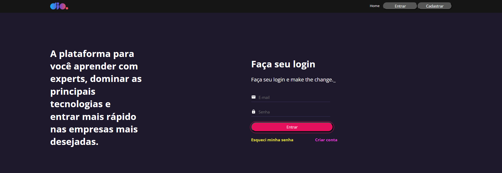

### DIO Clone

DIO Clone is a project developed with React JS to create a web applications that simulates the DIO web pages: Home, Login, Sign Up and Feed. 

## Screenshot

## Getting Started with Create React App

This project was bootstrapped with [Create React App](https://github.com/facebook/create-react-app).

## How to Run the Project

1. Clone this repository.
2. Install all dependencies using `npm install`.
3. Run the application with `npm start` and open [http://localhost:3000](http://localhost:3000) to view it in your browser (if it doesn’t open automatically).
4. You can navigate between pages by visiting the following URLs: [http://localhost:3000/login](http://localhost:3000/login), [http://localhost:3000/signup](http://localhost:3000/signup) and [http://localhost:3000/feed](http://localhost:3000/feed). Alternatively, you can use the "Começar agora", "Entrar"(using the user data written in db.json) and "Criar minha conta" buttons.

## Prerequisites

- Node.js (version 14 or higher recommended).
- npm (comes with Node.js)

## Available Scripts

In the project directory, you can run:

### `npm start`
Runs the app in the development mode.

### `npm test`
Launches the test runner in the interactive watch mode.

### `npm build`
Builds the app for production to the `build` folder.